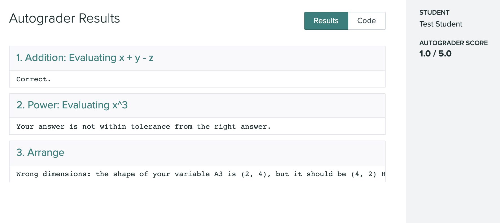

# gspack

Programming Assignment Packager for Gradescope Autograder.

## Goal

`gspack` converts your programming assignment solution into a Gradescope Autograder compatible archive. It also enables
you to grade solutions in Python, MATLAB, and Jupyter Notebooks on Gradescope within one assignment.

This instrument was originally developed for the needs of the Department of Applied
Mathematics in University of Washington, Seattle with the goal of minimizing the time an 
instructor spends for setting up coding assignments on Gradescope. This tool is suitable for the situations when 
the class that you teach has a certain programming component, but the main focus
is **not** on the effective and robust implementations, but rather on methods and concepts which students are expected
to implement. This is often the case for non-CS STEM classes, like scientific computing in applied math. When you just
want to make Gradescope checking correctness of certain values in students coding solutions in Python, Jupyter, or
MATLAB, and you don't have time to learn how to create Gradescope Autograder archives -- this tool is for you. However,
if you want to write rigorous test suites, which test execution speed and correctness of students functions
on arbitrary input -- [gradescope-utils](https://github.com/gradescope/gradescope-utils) is what you need.


## Installation

> **_Windows:_**  This program was tested on Windows 10 with Anaconda3. See the instructions at:
> 
> https://www.anaconda.com/products/individual
> 
> Please use "Command Prompt (Anaconda3)" as your terminal.
>
> **_MacOS:_** Use of Anaconda3 is recommended.

To install `gspack` use:

```shell script
$ pip install gspack
```

in your terminal.

For MATLAB Support, follow the instructions which `gspack` prints at the end of its installation.

## Usage

In order to make your assignment `gspack`-compatible you need to create a brief description of your rubric and put it to
the `test_suite` variable.

### Example for Python

Suppose you are writing a solution for a Homework 0 in Python 101 where students are supposed to familiarize themselves
with the basics of Python:

```python
import numpy as np

x = 10
y = -2
z = np.pi

A1 = x + y - z
A2 = x ** 3

with open("matrix.csv", "r") as f:
    matrix = np.loadtxt(f, delimiter=",")

U, S, V = np.linalg.svd(matrix, full_matrices=True)
A3 = U[:, :2]
```

Now you want to make the rubric based on variables `A1`, `A2` and `A3`. All you need to do is to define the following
dictionary and list in your solution file:

```python
test_suite = [
    {
        "test_name": "Addition",
        "variable_name": "A1",
        "description": "Evaluating x + y - z",
        "score": 1,
    },
    {
        "test_name": "Power",
        "variable_name": "A2",
        "description": "Evaluating x^3",
        "hint_tolerance": "Check power.",
        "score": 1
    },
    {
        "test_name": "Arrange",
        "variable_name": "A3",
        "hint_wrong_size": "Check transposition",
        "rtol": 1e-5,
        "atol": 1e-2,
        "score": 3
    }
]

extra_files = ["matrix.csv"]
```

This will create three tests: "Addition", "Power", and "Arrange". Each, being done correctly, will give to a student 1,
1, and 3 points respectively, with the total of 5 points. In the last part we also define custom relative and absolute
tolerances, which are sometimes necessary for taking round-off and numerical errors into account properly.

Now we launch the `gspack`: in the terminal, type

```shell script
$ gspack path/to/the/hw0_solution.py
```

and you should see something like this:

```shell script
Found and executed successfully: 
-> /path/to/the/hw0_solution.py
Found the test suite configuration:
-> Addition: OK
-> Power: OK
-> Arrange: OK
The total number of points is 5.
Number of attempts: unlimited.
Supported platforms: python
Generating the archive:
-> setup.sh: OK
-> run_autograder: OK
Looking for package requirements for your solution:
-> Generated via pipreqs: OK
Find extra files list:
-> matrix.csv: OK
Archive created successfully: 
-> /path/to/the/autograder.zip
```

The `autograder.zip` will be in the same directory to your `hw0_solution.py`. This archive contains all necessary
scripts, extra files listed in `extra_files`, and instructions for Gradescope Autograder, so now you can create a new
Gradescope programming assignment and to upload this archive when prompted.

Next, suppose a student writes the following solution for this assignment:

```python
import numpy as np

x = 10
y = -2
z = np.pi

A1 = x + y - z
A2 = x ** 4

with open("matrix.csv", "r") as f:
    matrix = np.loadtxt(f, delimiter=",")

U, S, V = np.linalg.svd(matrix, full_matrices=True)
A3 = U[:, :2].T
```

The first part is correct, the second part is wrong, and the third part is okay but the transposition is wrong.

When this solution is submitted, the student should see something like this:



### Formal Syntax of `test_suite`

Formally, the `test_suite` instruction has the following syntax:

```python
test_suite = [
    # for each test:
    {"test_name": "<test_name>",            # **Required** string. <test_name> is whatever string you want.
     "variable_name": "<variable_name>",    # **Required** string. Substitute the name of the variable to check.
     "score": "<score>",                    # _Optional_ int, default = 1. How many points to give for this part. 
     "description": "<description>",        # _Optional_ string. Description of the test, appears in the test title.
     "rtol": "<rtol>",                      # _Optional_ float, default = 1e-8, relative tolerance.
     "atol": "<atol>",                      # _Optional_ float, default = 1e-5, absolute tolerance.

     # Language-agnostic hints
     "hint_not_defined": "<sting>",         # _Optional_ string, appears if <variable_name> is not defined in the student's solution.
     "hint_wrong_type": "<string>",         # _Optional_ string, appears if <variable_name> is defined, but its type is wrong
     "hint_wrong_size": "<string>",         # _Optional_ string, appears if the <variable_name> has wrong shape (for matrices)
     "hint_nans": "<string>",               # _Optional_ string, appears if the <variable_name> contains NaNs
     "hint_tolerance": "<string>",
                                            # _Optional_ string, appears if the <variable_name> does not pass the tolerance requirements.
     # Language-specific hints are formed via adding suffix "_python" or "_matlab". For example:
     "hint_wrong_size_python": "<string>",  # _Optional_ string, appears only for Python submissions 
                                            # if the <variable_name> has wrong shape (for matrices)
     }
]
```

For each test, the grading system will go through the following checklist:

1. Is the `<variable_name>` defined in the submitted solution after it finishes execution?
2. If it is defined, does it have the right type?
3. If the type is right, do the dimensions match to what's expected when the answer is an array?
4. Does the answer contain any NaNs?
5. If everything above is okay, does the answer pass the tolerance requirements?

For the later one, the [`numpy.allclose`](https://numpy.org/doc/stable/reference/generated/numpy.allclose.html) function
is used:

```shell script
passed = np.allclose(student_answer, solution_answer, rtol=rtol, atol=atol)
```

Its internal formula is:

```
absolute(a - b) <= (atol + rtol * absolute(b))
```

and it's applied **element-wise**.

If the test fails, GradeScope will show the student a message which clarifies what went wrong.

## Q&A and extra capabilities

### 1) Extra files

**Q**: What if my, as well as students', script needs **extra files**, such as datasets, to work?

**A**: You can list these files in the variable `extra_files`:

```python
extra_files = ["test_data.csv", "train_data.csv"]
``` 

`gspack` expects them to be in the same directory as the solution script. It will add them to the `autograder.zip`
and will place them accordingly when grading students submissions. Notice that it means that students
*do not need to submit their copies of extra files* to Gradescope: they can expect these files to be in the solution's
directory on the grading server.

The kind of files or their extension do not matter.

### 2) Maximum number of attempts

**Q**: How can I set the **maximum number of attempts**?

**A**: By setting anywhere in the solution file:

```python
number_of_attempts = 5  # or whatever number you want
```

The number of attempts is unlimited by default.

The **"Test Student"** user is always excused from this limit to allow the instructor to do as many test submissions as
they need. To use this feature you need to add a student to your roster with the name "Test Student" and the email "
test_student@gspack.com". In order to make a submission as a "Test Student" 
you need to go to your assignment, then click “Manage Submissions” on the left panel,
then hit the “Upload Submission” button on the lower right,
and there will be an option to choose the name in the pop-up window.

### 3) Total score and even distribution of points

**Q:** Can I specify the **total score** for my assignment instead of assigning the score to every submission
individually?

**A:** Yes: you just need to set

```python
total_score = 50  # or anything
```

and `gspack` will distribute these points evenly among your rubric. If you define both `total_score` and individual
tests' scores then it should be consistent, i.e. individual scores should be equal to `total_score` divided by the
number of tests in `test_suite`. Practically there is no reason to define them both simultaneously.

### 5) Submitting solutions in multiple files

**Q:** Can my students submit solutions in multiple files?

**A:** Yes. To enable this feature you'll need to set

```python
main_file_name = "homework0"
```

in your solution file to indicate the name of the main file, which gradescope will launch. Notice that **you don't need
to add the extension**, like ".py", to the file's name, so students could use more than one language (see below).

If this feature is inactive then students will be able to submit **only one** file with any name. Students submitting
multiple files without this feature being active **will lose an attempt**: `gspack` will tell them that it does not
understand which file to launch.

### 6) Jupyter Notebooks, MATLAB.

`gspack` is designed to support grading submission on different languages within the same assignment. Currently, it
equally supports three platforms: Python, MATLAB, and Jupyter Notebooks. It means that you only need write a solution
in **one** language out of this three (say, in MATLAB) to grade submissions in **all three** these languages. In other
words, you don't need to provide a Python solution to make Gradescope grade Python submissions too: `gspack` will make
Gradescope grading these Python submissions using your MATLAB solution!

In order to activate this feature you need to add the list of supported platforms to your solution files:

```python
supported_platforms = ["python", "matlab", "jupyter"]
```

When `supported_platforms` is not set, `gspack` will support only submissions in the same language the solution is
written on.

#### 6.1) Jupyter Notebooks

Jupyter is an open-source platform, so no extra steps are needed besides putting `jupyter` in the list of your supported
platforms.

#### 6.2) MATLAB

Matlab is a proprietary platform, so first you need to make sure that your university provides a total headcount license
for your students. `gspack` **DOES NOT** provide MATLAB distributions to launch your student's codes on Gradescope
servers. In practice, supporting MATLAB submissions also requires having a proxy server which allows MATLAB to reach
your university's license servers. In total, in order to enable MATLAB support in gspack you'll need to obtain a license
file, a standalone MATLAB distribution archive, and everything your need to allow MATLAB to reach its university license
servers.

**If you're from Department of Applied Mathematics in the University of Washington -- contact `gspak`'s admins to
receive the aforementioned components and related instructions.**

For generating an autograder archive based on MATLAB solution you'll need to provide the rubric in a separate .json
file. For example, say your `solution.m` for the Homework 0 above looks like this:

```matlab
x = 10;
y = -2;
z = pi;

A1 = x + y - z;
A2 = x^3;

matrix = table2array(readtable('matrix.csv'));
[U, S, V] = svd(matrix);
A3 = U(:, 1:2);
```

You'll need to create a file called `rubric.json` alongside with your solution:

```json
{
  "test_suite": [
    {
      "test_name": "Addition",
      "variable_name": "A1",
      "description": "Evaluating x + y - z",
      "score": 1
    },
    {
      "test_name": "Power",
      "variable_name": "A2",
      "description": "Evaluating x^3",
      "hint_tolerance": "Check power.",
      "score": 1
    },
    {
      "test_name": "Arrange",
      "variable_name": "A3",
      "hint_wrong_size": "Check transposition",
      "rtol": 1e-5,
      "atol": 1e-2,
      "score": 3
    }
  ],
  "number_of_attempts": 3,
  "extra_files": [
    "matrix.csv"
  ],
  "supported_platforms": [
    "jupyter",
    "python",
    "matlab"
  ],
  "matlab_credentials": "~/gspack_matlab_credentials"
}
```

New field -- `matlab_credentials` -- points to the directory with the extra MATLAB components described above. If you
use Python solution, you can add it as:

```python
matlab_credentials = "~/gspack_matlab_credentials"
```

When `rubric.json` is ready, you can generate `autograder.zip` via:

```shell
$ gspack --rubric path/to/rubric.json path/to/solution.m
```