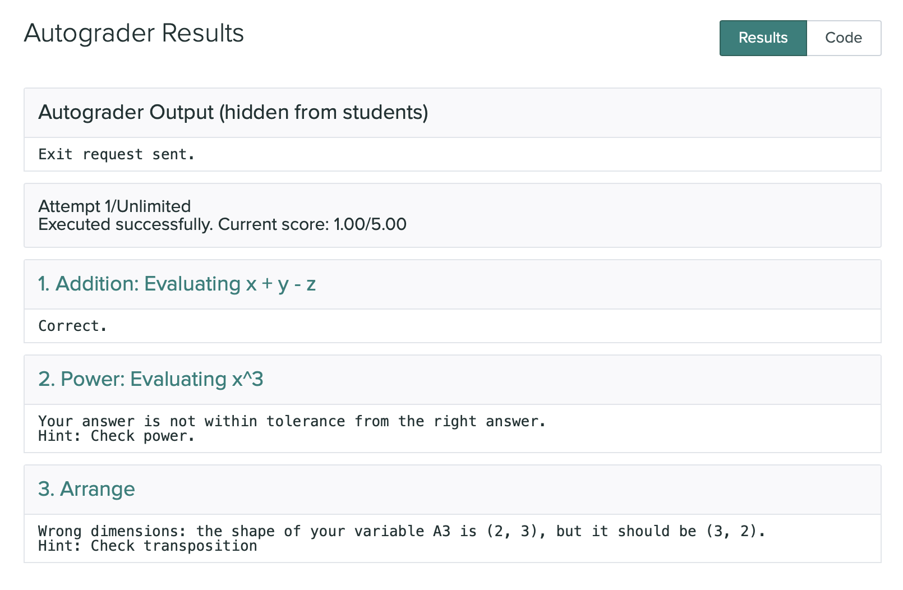

# gspack
Programming Assignment Packager for GradeScope Auto Grader.

## Goal
`gspack` converts your programming assignment solution into a GradeScope Auto-Grader compatible archive. 

**TL;DR:** *If you just want to make GradeScope checking correctness of certain values in students coding solutions, and
 you don't have time to learn how to create Gradescope Autograder archives -- this tool is for you. 
 However, if you want to write actual test suites, which test speed/correctness of students functions on arbitrary
 input -- [gradescope-utils](https://github.com/gradescope/gradescope-utils) is what you need*.

This tool
 addresses situations when the class you teach has a certain programming component, but the main 
 focus is **not** on the effective and robust implementations, but rather on methods and concepts which students are expected
 to implement. This is often the case for non-CS STEM classes, like scientific computing in applied math.

## Installation

To install `gspack` you need to clone this repo to your machine

```shell script
$ git clone https://github.com/aksholokhov/gspack
```
and then to install it as a Python package:
```shell script
$ cd gspack 
$ python setup.py install
```

## Usage 
In order to make your assignment `gspack`-compatible you need to create a brief description of your rubric 
and put it to the `test_suite` variable.
 
### Example
Suppose you are writing a solution for a Homework 0 in Python 101 where students are supposed to familiarize themselves with the
 basics of Python:

```python
import numpy as np

x = 10
y = -2
z = np.pi

A1 = x + y - z
A2 = x**3

with open("matrix.csv", "r") as f:
    matrix = np.loadtxt(f, delimiter=",")

U, S, V = np.linalg.svd(matrix, full_matrices=True)
A3 = U[:, :2]
```
Now you want to make the rubric based on variables `A1`, `A2` and `A3`. All you need to do is to define the following 
dictionary and list in your solution file:
```python
test_suite = [
    {
        "test_name": "Addition",
        "variable_name": "A1",
        "description": "Evaluating x + y - z",
        "score": 1,
    },
    {
        "test_name": "Power",
        "variable_name": "A2",
        "description": "Evaluating x^3",
        "hint_tolerance": "Check power.",
        "score": 1
    },
    {
        "test_name": "Arrange",
        "variable_name": "A3",
        "hint_wrong_size": "Check transposition",
        "rtol": 1e-5,
        "atol": 1e-2,
        "score": 3
    }
]

extra_files = ["matrix.csv"]
```
This will create three tests "Addition", "Power", and "Arrange", each, being done correctly, will give to a student 
1, 1, and 3 points respectively, with the total of 5 points. In the last part we also define custom relative and absolute
tolerances: sometimes it's necessary for taking round-off and numerical errors into account properly. 

Now we launch the `gspack`: in the terminal, type
```shell script
$ gspack --solution path/to/the/hw0_solution.py
```
and you should see something like this:
```shell script
Found the solution file:
-> /from/root/path/to/the/hw0_solution.py
Found the test suite configuration:
-> Addition: ok
-> Power: ok
-> Arrange: ok
Find extra files list:
-> matrix.csv: ok
Archive created successfully:
-> /from/root/path/to/the/autograder.zip
```
The `autograder.zip` will be in the same directory to your `hw0_solution.py`. This archive contains all necessary
scripts, extra files listed in `extra_files`, and instructions for GradeScope AutoGrader, so now you can create a new GradeScope programming
assignment and to upload this archive when prompted. 

Next, suppose a student writes the following solution for this assignment: 
```python
import numpy as np

x = 10
y = -2
z = np.pi

A1 = x + y - z
A2 = x**4

with open("matrix.csv", "r") as f:
    matrix = np.loadtxt(f, delimiter=",")

U, S, V = np.linalg.svd(matrix, full_matrices=True)
A3 = U[:, :2].T
```

The first part is correct, the second part is wrong, and the third part is okay
but the transposition is wrong. 

When this solution is submitted, the student should see something like this:



### Formal Syntax
Formally, the `test_suite` instruction has the following syntax:

```python
test_suite = [
    # for each test:
    {   "test_name": "<test_name>",                 # **Required** string. <test_name> is whatever string you want.
        "variable_name": "<variable_name>",         # **Required** string. Substitute the name of the variable to check.
        "score": <score>,                           # _Optional_ int, default = 1. How many points to give for this part. 
        "description": "<description>",             # _Optional_ string. Description of the test, appears in the test title.
        "rtol": <rtol>,                             # _Optional_ float, default = 1e-8, relative tolerance.
        "atol": <atol>,                             # _Optional_ float, default = 1e-5, absolute tolerance.
        
        # Language-agnostic hints
        "hint_not_defined": "<sting>",              # _Optional_ string, appears if <variable_name> is not defined in the student's solution.
        "hint_wrong_type": "<string>",              # _Optional_ string, appears if <variable_name> is defined, but its type is wrong
        "hint_wrong_size": "<string>",              # _Optional_ string, appears if the <variable_name> has wrong shape (for matrices)
        "hint_nans": "<string>",                    # _Optional_ string, appears if the <variable_name> contains NaNs
        "hint_tolerance": "<string>"                # _Optional_ string, appears if the <variable_name> does not pass the tolerance requirements.
        
        # Language-specific hints are formed via adding suffix "_python" or "_matlab". For example:
        "hint_wrong_size_python": "<string>",       # _Optional_ string, appears only for Python submissions 
                                                    # if the <variable_name> has wrong shape (for matrices)
    }
]
```

For each test, the grading system will go through the following checklist:
1. Is the `<variable_name>` defined in the submitted solution after it finishes execution? 
2. If it is defined, does it have the right type?
3. If the type is right, do the dimmensions match to what's expected?
4. Does the answer contain any NaNs?
5. If everything above is okay, does the answer pass the tolerance requirements?

For the later one, the [`numpy.allclose`](https://numpy.org/doc/stable/reference/generated/numpy.allclose.html) function is used:
```shell script
passed = np.allclose(student_answer, solution_answer, rtol=rtol, atol=atol)
```
Its internal formula is:
```
absolute(a - b) <= (atol + rtol * absolute(b))
```
and it's applied **element-wise**. 

If the test fails, GradeScope will show the student a message which clarifies what went wrong.

## Q&A and extra capabilities
### 1) Extra files
**Q**: What if my, as well as students',  script needs **extra files**, such as datasets, to work?

**A**: You can list these files in the variable `extra_files`:
```python
extra_files = ["test_data.csv", "train_data.csv"]
``` 
`gspack` expects them to be in the same directory as the solution script. It will add them to the `autograder.csv` 
and will place them accordingly when grading students submissions. The kind of files or their extension do not matter.

### 2) Maximum number of attempts
**Q**: How can I set the **maximum number of attempts**?

**A**: By setting (anywhere in the solution):
```python
number_of_attempts = 5    # or whatever number you want
```
The number of attempts is unlimited by default. 

The **"Test Student"** user is always excused from this limit 
to allow the instructor to do as many test submissions as they need. 
There is no specific email for **Test Student**: the only thing checked is that the name is "Test Student".

### 3) Total score and even distribution of points
**Q:** Can I specify the **total score** for my assignment instead of assigning the score to every 
submission individually?

**A:** Yes: you just need to set 
```python
total_score = 50 # or anything
```
and `gspack` will distribute these points evenly among your rubric. Note that this is an "either-or" option: you can 
either define `total_score` OR all individual test's scores. Defining them both will result in an error
 (`gspack` will explain what is wrong).

### 4) MATLAB

**Q**: Can gspack grade **MATLAB submissions** too, alongside with Python submissions? 

**A**: Yes, it can grade MATLAB submissions too. However, it requires additional steps, since Gradescope does 
not provide any MATLAB distribution on their servers. To our experience, Total Head Count MATLAB license 
can be used successfully to make Gradescope grading MATLAB submissions on behalf of your class. If your university
or department has this type of license purchased, and you're willing to try using gspack with it, you can contact
 me at aksh (at) uw (dot) edu, and I'll explain how to do this.
 
*NB: **UW AMATH Instructors** -- see the **MATLAB instruction** in the credentials repo's README*.

To be clear: the instructor's solution should still be in Python, even if you plan to only support MATLAB 
as the language in your class. gspack can not generate a Gradescope autograder archive based on a MATLAB solution and, 
due to certain technical limitations of MATLAB Engine's API, I don't expect it to ever be able to. 